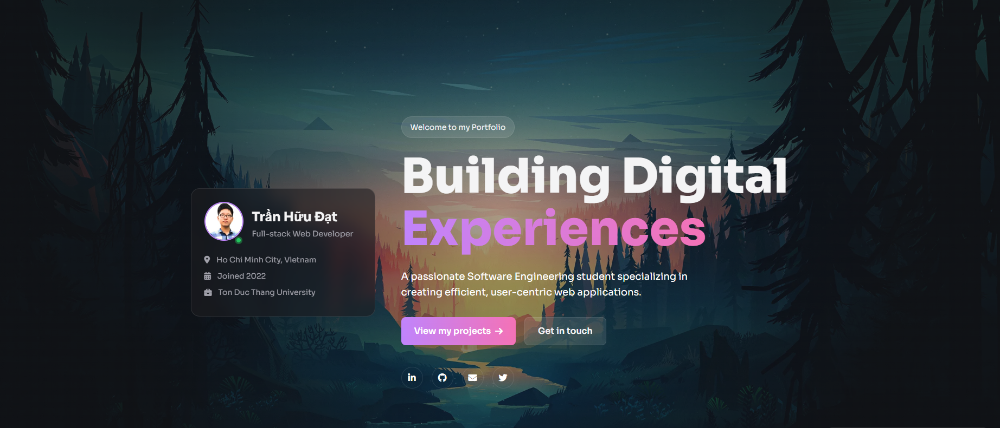

# Trần Hữu Đạt - Personal Portfolio 2025

 <!-- THAY THẾ bằng ảnh chụp màn hình trang chủ portfolio mới của bạn -->

Welcome to the source code repository for my personal portfolio website, meticulously redesigned for 2025. This site acts as a dynamic showcase of my skills, featured projects, and professional journey. It features a modern, dark-themed, single-page design enhanced with fluid animations and rich interactive elements to provide an immersive user experience.

<p align="center">
  <a href="https://github.com/TranHuuDat2004" target="_blank">
    
  </a>
  <a href="https://tranhuudat2004.github.io/" target="_blank">
    
  </a>
  <a href="https://github.com/TranHuuDat2004/tranhuudat2004.github.io/releases/latest" target="_blank">
    
  </a>
  <!-- <a href="https://github.com/TranHuuDat2004/Galactic-Guardian" target="_blank">
    
  </a> -->
</p>

## ✨ Key Features

This portfolio has been rebuilt from the ground up to incorporate modern web features:

*   **🎨 Modern Dark-Themed UI:** A sleek, visually appealing dark mode interface that's easy on the eyes and highlights content effectively.
*   **💡 Light/Dark Mode Toggle:** Users can seamlessly switch between dark and light themes. Their preference is automatically saved in `localStorage` for future visits.
*   **🚀 Single-Page Architecture:** A smooth, continuous scrolling experience with all sections accessible from a single page (`index.html`), enhanced by an auto-hiding sticky header.
*   **📜 Dynamic Content & Animations:**
    *   **Scroll-Triggered Animations:** Elements gracefully fade and slide into view as the user scrolls down the page, powered by `IntersectionObserver`.
    *   **Live GitHub Skill Bars:** The "Technical Stack" section dynamically fetches data from the GitHub API to calculate and display skill percentages, providing a real-time reflection of my coding activity.
    *   **Interactive Alternating Project Layout:** Featured projects are presented in an engaging, alternating showcase layout that highlights key features and visuals.
*   **📚 Integrated Blog System:**
    *   A dedicated **Blog Section** on the main page previews the latest articles.
    *   Separate, fully-styled pages for the main blog (`blog.html`) and individual posts (`post-*.html`) ensure a consistent experience.
*   **🎵 Embedded Music Player:** A subtle, fixed music player widget provides background music with basic controls (play/pause, next/previous).
*   **📱 Fully Responsive Design:** Meticulously crafted with custom CSS (Flexbox & Grid) to ensure a flawless experience on all devices, from large desktops to mobile phones.

## 🛠️ Technology Stack

*   **HTML5:** Semantic markup for a well-structured and accessible site.
*   **CSS3:** Advanced custom styling, including:
    *   **CSS Variables:** For easy theme management (Light/Dark mode).
    *   **Flexbox & Grid:** For creating complex, responsive layouts.
    *   **Animations & Transitions:** For smooth, scroll-triggered effects and interactive elements.
*   **JavaScript (ES6+):** Powers all the dynamic and interactive functionalities:
    *   **GitHub API Integration:** Fetches repository data to dynamically generate skill bars.
    *   **`IntersectionObserver` API:** Efficiently handles scroll-based animations.
    *   **DOM Manipulation:** Manages all UI interactions, including the theme toggle, music player, and header behavior.
*   **Hosting:** Deployed as a static website via [GitHub Pages](https://pages.github.com/).

## 🚀 How to View / Local Setup

1.  **Live Site:**
    *   The portfolio is live at: [https://tranhuudat2004.github.io/](https://tranhuudat2004.github.io/)

2.  **Local Setup:**
    *   Clone this repository:
        ```bash
        git clone https://github.com/TranHuuDat2004/tranhuudat2004.github.io.git
        ```
    *   Navigate into the cloned directory:
        ```bash
        cd tranhuudat2004.github.io
        ```
    *   Open `index.html` (or `new-version.html` if you haven't renamed it yet) directly in your web browser. No special build steps are required.

## 🌟 Future Enhancements (Ideas)

*   Add more detailed project pages for each item in the showcase.
*   Implement a search functionality for the blog.
*   Further performance optimizations, such as lazy loading for images.

## 👤 Author & Contact

*   **Trần Hữu Đạt**
    *   **GitHub:** [@TranHuuDat2004](https://github.com/TranHuuDat2004)
    *   **LinkedIn:** [linkedin.com/in/tranhuudat2004](https://linkedin.com/in/tranhuudat2004)
    *   **Email:** `tranhuudat.cv@gmail.com`

---

<p align="center">
  Thank you for visiting my portfolio. I'm always open to connecting and discussing technology!
</p>
