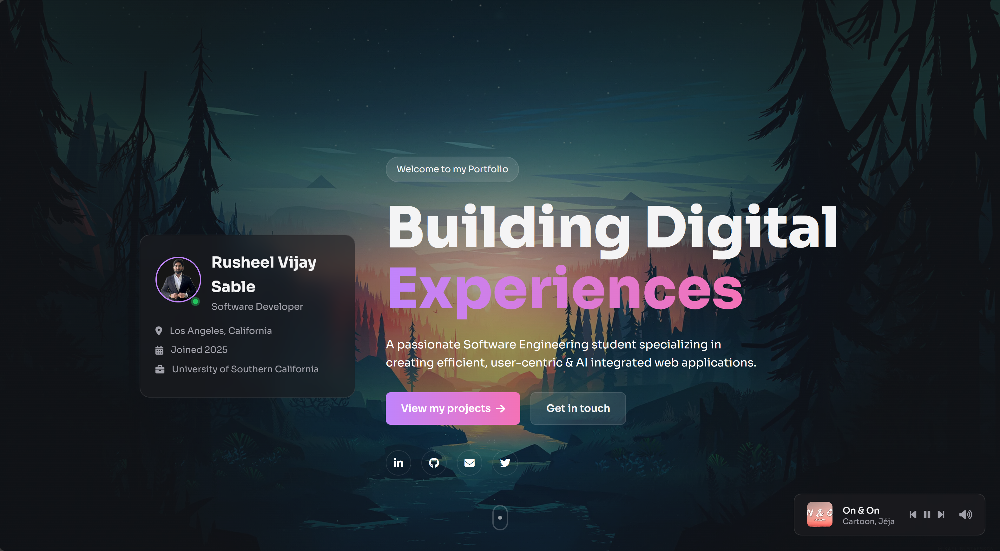

# ⚡ Rusheel Vijay Sable | Interactive Portfolio



> **"Building Digital Experiences at the Intersection of Data & Scalable Software."**

This is not just a static HTML page. It is a **reactive, automated, and modular** web application serving as the central hub for my work in **Generative AI, Computer Vision, and Full-Stack Engineering**. It features a custom-built audio engine, real-time data pipelines, and a glassmorphic UI design system.

---

## 🔮 Core Architecture & "The Flex"

### 1. 🤖 CI/CD Automation Pipeline
Instead of manually updating skills or repository stats, this portfolio runs its own **DevOps pipeline**.
* **Logic:** A custom Node.js script (`scripts/update-stats.js`) hits the GitHub REST API to fetch my latest repository data and language breakdown.
* **Automation:** A **GitHub Actions Workflow** (`.github/workflows/update-stats.yml`) triggers this script daily via a cron job (`0 18 * * *`).
* **Result:** The site automatically commits and updates `github_stats.json`, keeping my "Technical Stack" section real-time without manual intervention.

### 2. 🎵 Custom JavaScript Audio Engine
No `<iframe>` embeds here. The music player is a fully custom JavaScript module (`js/playlist.js` + `js/scripts.js`).
* **State Management:** Handles play/pause states, track switching, and volume control directly through the DOM Audio API.
* **Asset Management:** Curated playlist (Alan Walker, Lo-Fi) loaded dynamically from the `assets/music/` directory.

### 3. 🎨 Component-Based CSS System
Despite using Vanilla CSS, the project mimics modern framework architecture (like React/Vue) using a modular split:
* **Atomic Design:** Styles are decoupled into `css/components/` (e.g., `hero.css`, `glass-card.css`, `animations.css`).
* **Theming:** Centralized CSS variables (`theme.css`) handle the **Dark/Light mode** toggle and accent colors.

---

## 🧠 Featured Technical Projects

This portfolio acts as a gateway to my deep-tech projects.

### 🧬 Adaptive GenAI Learning Agent
* **Tech:** Python (FastAPI), Redis Pub/Sub, WebSockets, Docker, Mistral 7B.
* **Architecture:** Real-time multiplayer quiz platform featuring a **Hot/Cold storage** dual-path architecture.
* **AI Integration:** Uses **LLMs (Mistral 7B)** to generate questions on the fly and an adaptive engine that adjusts difficulty based on live user performance.

### 👁️ Smart Attendance (Computer Vision)
* **Tech:** OpenCV, Python, Deep Learning (CNNs), SQL.
* **Function:** Automated, contactless attendance system.
* **Pipeline:** Real-time video feed ingestion -> Face Detection -> Feature Extraction -> SQL Database Logging.

### 🍕 FOMS (Food Ordering Management System)
* **Tech:** PHP, MySQL, AI Voice Integration.
* **Optimization:** Backend queries optimized to reduce latency by 20% under high-load simulations (200+ daily orders).

---

## 🛠️ Tech Stack

| Layer | Technologies |
| :--- | :--- |
| **Frontend** | HTML5 (Semantic), Modular CSS3, Vanilla JavaScript (ES6+) |
| **UI/UX** | Glassmorphism, Intersection Observer API (Scroll Animations), FontAwesome |
| **Backend Logic** | Node.js (Data Fetching Scripts), REST APIs |
| **DevOps** | GitHub Actions (CI/CD), Cron Jobs, Git |
| **Data** | JSON (Static Data Storage), MySQL (Project Integrations) |

---

## 📂 Repository Structure

```text
rusheel-portfolio/
├── .github/workflows/   # ⚙️ CI/CD Pipelines
│   └── update-stats.yml # Daily cron job for stats
├── assets/              # 📦 Static Assets (Music, Images, Resumes)
├── css/                 # 🎨 Modular Styling
│   ├── components/      # (hero.css, music-player.css, skills.css...)
│   └── style.css        # Main entry point
├── js/                  # ⚡ Core Logic
│   ├── playlist.js      # Music data structure
│   ├── portfolio.js     # Dynamic content injection
│   └── scripts/         # Backend Node.js scripts
├── index2.html          # 🏠 Main Entry (Portfolio V2)
├── project.html         # 📂 Project Showcase
└── README.md            # 📄 Documentation

```

---

## 🚀 Local Deployment

Since this project relies on **modular CSS** and **JSON fetching**, it is best run on a local server to avoid CORS policies.

1. **Clone the Repository**
```bash
git clone [https://github.com/rusheel080703/rusheel-portfolio.git](https://github.com/rusheel080703/rusheel-portfolio.git)
cd rusheel-portfolio

```


2. **Start a Local Server**
* **VS Code:** Install "Live Server" extension -> Right-click `index2.html` -> "Open with Live Server".
* **Python:**
```bash
python -m http.server 8000
# Open localhost:8000/index2.html

```


* **Node.js:**
```bash
npx serve .

```


---

## 👨‍💻 Author

**Rusheel Vijay Sable**

* **Master's in Computer Science** @ University of Southern California (USC)
* **Focus:** AI/ML, Full-Stack Development, scalable Systems.

---

*Built with ❤️, code, and a lot of caffeine in Los Angeles.*

